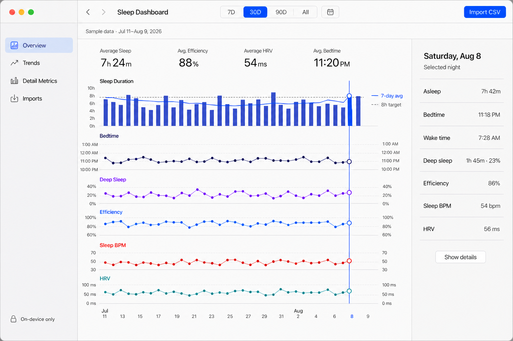
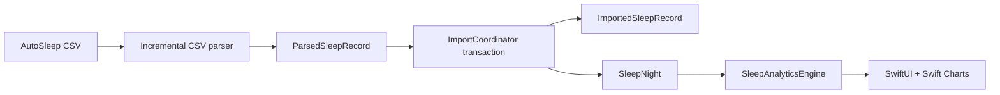

# Sleep Dashboard

A private, native macOS app for importing AutoSleep CSV history and exploring
sleep trends without creating an account or uploading health data.

> Status: runnable macOS v1 built with SwiftUI, Swift Charts, and SwiftData.

<picture>
  <source
    media="(prefers-color-scheme: dark)"
    srcset="./design/mockups/sleep-dashboard-native-dark.png"
  >
  
</picture>

## What it does

- Imports AutoSleep History CSV files through the macOS system file picker.
- Shows Sleep Duration, Bedtime, Deep Sleep, Efficiency, Sleep BPM, and HRV on
  one aligned date axis.
- Uses one shared selection across every chart, with exact values in a native
  inspector.
- Provides 7-day, 30-day, 90-day, and all-time ranges.
- Includes secondary metrics for SpO2, respiration, apnea-hypopnea index,
  awake duration, time in bed, and session count.
- Handles comma or semicolon delimiters, UTF-8 BOMs, quoted fields, embedded
  newlines, malformed rows, and missing optional metrics.
- Detects exact re-imports with a stable SHA-256 row fingerprint.
- Stores raw imported rows and derived nightly summaries locally with SwiftData.
- Supports system light and dark appearances, keyboard date navigation, and
  VoiceOver descriptions.
- Displays clearly labelled sample data until the first import succeeds.

## Privacy model

Sleep Dashboard has no backend, account system, cloud sync, or network-based
analysis. CSV parsing, persistence, aggregation, and chart rendering happen on
the Mac.

Imported data can be deleted from **Imports → Delete All Imported Data**. The
app asks for confirmation before removing both imported rows and nightly
summaries.

## Requirements

- macOS 14 or later
- Xcode with Swift 6.2 or later, or a compatible Swift toolchain

The project has no third-party package dependencies.

## Quick start

Clone the repository and run the Swift Package executable:

```bash
git clone https://github.com/Ray0907/SleepDashboard.git
cd SleepDashboard
swift run SleepDashboard
```

To work in Xcode, open `Package.swift` and run the `SleepDashboard` executable
scheme.

## Import an AutoSleep CSV

1. Export your History CSV from AutoSleep and transfer or save it to the Mac.
2. Open Sleep Dashboard and choose **Import CSV** in the toolbar.
3. Select the CSV with the system file picker.
4. Review the imported, skipped, and duplicate row counts in **Imports**.
5. Return to **Overview** or **Trends** to inspect the imported nights.

CSV timestamps are interpreted in the Mac's current time zone at import time
because AutoSleep exports do not include a per-row time zone.

### CSV contract

Required columns are matched case-insensitively, with common aliases accepted:

| Required field | Format |
| --- | --- |
| `startDate`, `endDate` | `yyyy-MM-dd HH:mm:ss` |
| `bedtime`, `wakeTime` | `yyyy-MM-dd HH:mm:ss` |
| `inBed`, `awake`, `asleep`, `deep` | `HH:mm:ss` |
| `efficiency` | Number from 0 to 100, with an optional `%` suffix |
| `sessions` | Non-negative integer |

Optional metrics may be absent or blank:

`sleepBPM`, `hrv`, `spo2Avg`, `spo2Min`, `spo2Max`, `respAvg`, `respMin`,
`respMax`, and `apnea`/`ahi`.

The parser supports:

- UTF-8 with an optional BOM
- comma and semicolon delimiters
- an optional leading `sep=,` or `sep=;` directive
- RFC 4180 quoted fields, escaped quotes, and embedded newlines
- incremental 64 KiB file reads with cancellation-aware cleanup

A malformed data row is skipped and included in the import summary. A malformed
header or missing required column fails the import before anything is written.

## Analytics behavior

- Range boundaries include both their start and end dates.
- The 7-day moving average uses the trailing seven calendar days ending on each
  night and excludes dates without data from the denominator.
- Missing optional metrics remain `nil` and render as chart gaps, not zeros.
- Deep-sleep percentage is absent when total asleep duration is zero.
- Post-midnight bedtimes continue past hour 24, so 1:00 AM sorts after 11:00 PM.
- Summary averages are deterministic pure Swift calculations.

## Architecture



The two-layer persistence model keeps source evidence separate from the nightly
view used by the dashboard:

- `ImportedSleepRecord` preserves one row per imported CSV row and provides
  stable re-import identity.
- `SleepNight` is a recomputed nightly aggregate consumed by analytics and views.
- `ImportCoordinator` commits new records and every touched nightly summary in
  one SwiftData transaction.
- `SleepAnalyticsEngine` contains pure, independently tested range and trend
  calculations.

## Project structure

```text
Sources/SleepDashboard/
├── Analytics/   Pure range summaries and chart points
├── Import/      CSV streaming, validation, deduplication, and persistence
├── Models/      SwiftData models and deterministic sample data
├── Views/       Native dashboard, charts, inspector, details, and imports
└── SleepDashboardApp.swift

Tests/SleepDashboardTests/
├── AnalyticsTests.swift
├── AutoSleepCSVImporterTests.swift
├── DashboardViewStateTests.swift
├── ImportCoordinatorTests.swift
└── ModelTests.swift
```

## Verification

Run the complete test and build gate:

```bash
swift test && swift build
```

The XCTest suite covers models, deterministic analytics, RFC 4180 parsing,
chunk-boundary behavior, cancellation, transactional persistence, duplicate
imports, missing data, and dashboard view state.

## Current scope

Version 1 intentionally does not include:

- Apple Health `export.zip` import
- cloud sync or multi-user accounts
- Apple Health write-back
- AI-generated sleep narratives or medical recommendations

Future AI-assisted analysis, if added, is intended to remain optional and
on-device, working from verified summaries rather than raw CSV files.

Sleep Dashboard is an exploratory personal-data tool, not a medical device. Its
charts should not be used for diagnosis or treatment decisions.
